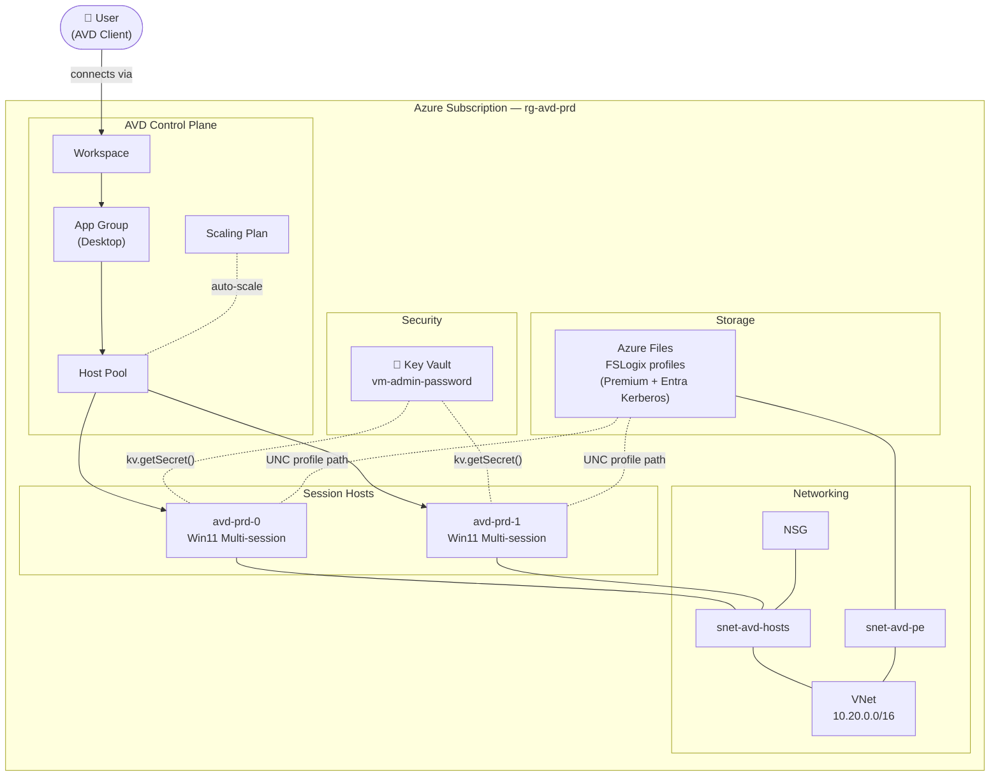
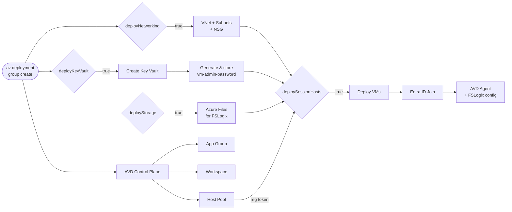

# Azure Virtual Desktop

End-to-end Bicep deployment for [Azure Virtual Desktop](https://learn.microsoft.com/en-us/azure/virtual-desktop/overview) — networking, FSLogix storage, Key Vault, AVD control plane, and session hosts. All layers are optional flags to support both greenfield and brownfield deployments.

## Architecture



## Deployment flow



## Structure

```
.azuredevops/
├── Deploy-AVD.yaml              # CD pipeline — deploys on push to main
└── PR-Validation.yaml           # CI pipeline — validates Bicep on PRs

.github/workflows/
├── avd.module.yml               # e2e test trigger (PSRule + defaults/max matrix)
├── e2e.reusable.yml             # Reusable e2e lifecycle (preflight → deploy → Pester → cleanup)
└── check-avm-versions.yml       # Weekly AVM version check — auto-raises PRs

bicep/
├── main.bicep                   # Orchestrator — wires all modules together
├── main.bicepparam              # Parameters (customise per environment)
└── modules/
    ├── networking.bicep         # VNet, session host subnet, PE subnet, NSG
    ├── keyvault.bicep           # Key Vault + auto-generated VM admin password
    ├── storage.bicep            # Azure Files (Premium, Entra Kerberos) for FSLogix
    ├── avd-control-plane.bicep  # Host pool, app group, workspace, scaling plan
    └── session-hosts.bicep      # Win11 multi-session VMs, Entra ID join, AVD agent

docs/
└── Getting-Started.md           # Prerequisites, enrolment, user assignment

scripts/
└── Update-AvmVersions.py        # AVM version checker (used by GitHub Actions)

tests/e2e/
├── defaults/
│   ├── main.test.bicep          # Minimal scenario — control plane, networking, KV, storage (no VMs)
│   └── avd.defaults.test.ps1   # Pester v5 assertions for defaults scenario
└── max/
    ├── main.test.bicep          # Full scenario — all features, 1 session host
    └── avd.max.test.ps1         # Pester v5 assertions for max scenario

bicepconfig.json                 # AVM public registry alias
```

## AVM modules used

| Module | Version | Resource |
|---|---|---|
| `avm/res/network/network-security-group` | 0.4.0 | NSG |
| `avm/res/network/virtual-network` | 0.4.0 | VNet and subnets |
| `avm/res/key-vault/vault` | 0.9.0 | Key Vault |
| `avm/res/storage/storage-account` | 0.14.0 | FSLogix Azure Files |
| `avm/res/desktop-virtualization/host-pool` | 0.3.0 | Host pool |
| `avm/res/desktop-virtualization/application-group` | 0.2.0 | Desktop app group |
| `avm/res/desktop-virtualization/workspace` | 0.3.0 | Workspace |
| `avm/res/desktop-virtualization/scaling-plan` | 0.2.0 | Auto-scaling (optional) |
| `avm/res/compute/virtual-machine` | 0.11.0 | Session host VMs |

Check latest versions: [AVM Bicep Resource Modules](https://azure.github.io/Azure-Verified-Modules/indexes/bicep/bicep-resource-modules/)

## CI / Testing

Testing follows the [Azure Verified Modules e2e pattern](https://azure.github.io/Azure-Verified-Modules/contributing/bicep/bicep-contribution-flow/validate-bicep-module-locally/).

### Pipeline overview

```
On push / PR (bicep/** or tests/**)
│
├── PSRule for Azure          Static analysis — compiles Bicep → ARM, runs best-practice rules.
│                             No Azure credentials needed. Blocks e2e if it fails.
│
├── e2e / defaults            Deploys control plane + networking + KV + storage (no VMs).
│                             Faster; validates the majority of the Bicep surface.
│
└── e2e / max                 Full deployment: everything including 1 session host + scaling plan.
                              Slower; validates the session host provisioning path.
```

Each e2e job runs the same lifecycle via `e2e.reusable.yml`:

```
OIDC login → what-if preflight → deploy → [allow runner IP] →
Pester assertions → [remove runner IP] → [AzQR] → [cost estimate] → cleanup
```

Dedicated resource groups (`dep-avdNNNN-avd-{scenario}`) are created per run and deleted after. Key Vaults are purged immediately to free the name for the next run.

### Test scenarios

| Scenario | `deploySessionHosts` | `deployScalingPlan` | Approx. duration |
|---|---|---|---|
| `defaults` | `false` | `false` | ~8 min |
| `max` | `true` (1 VM) | `true` | ~20 min |

### Pester assertions

Each scenario has a `*.test.ps1` file that checks all deployed resources by name (derived from `namePrefix`) using the Az PowerShell modules. The storage file-share check uses `Get-AzStorageShare` with a temporary runner IP allowlist entry — added before Pester, removed after.

### Optional analysis (workflow_dispatch only)

When triggering via **Actions → AVD Module — e2e Tests → Run workflow**, two optional toggles are available:

| Input | Description | Artifact |
|---|---|---|
| `run_azqr` | [AzQR](https://github.com/Azure/azqr) best-practice scan against deployed resources | `azqr-{scenario}/` (JSON + CSV) |
| `run_cost_estimate` | Per-resource monthly cost estimate via [Azure Retail Prices API](https://learn.microsoft.com/en-us/rest/api/cost-management/retail-prices/azure-retail-prices) | `cost-estimate-{scenario}/` (JSON + CSV + MD) |

Both are opt-in and do not run on push or PR triggers. The cost estimate also writes a summary table to the GitHub Actions job summary.

> **Note:** Cost Management actual charges appear 24–48 hours after resource creation. The cost estimate uses retail unit prices × assumed 730 hours/month and is indicative only.

### Running tests locally

```bash
# Deploy the defaults scenario
az deployment sub create \
  --location uksouth \
  --template-file tests/e2e/defaults/main.test.bicep \
  --parameters namePrefix=avdlocal

# Run Pester assertions (requires Az modules + Pester v5)
$env:TEST_SUBSCRIPTION = '<your-sub-id>'
$env:TEST_RG           = 'dep-avdlocal-avd-dfl'
$env:TEST_NAME_PREFIX  = 'avdlocaldfl'
Invoke-Pester ./tests/e2e/defaults -Output Detailed

# Cleanup
az group delete --name dep-avdlocal-avd-dfl --yes
az keyvault purge --name avdlocaldfl-kv --location uksouth
```

### Required secrets

The e2e workflows require these repository secrets (same as the existing validate workflow):

| Secret | Description |
|---|---|
| `AZURE_CLIENT_ID` | App registration client ID for OIDC federation |
| `AZURE_TENANT_ID` | Entra tenant ID |
| `AZURE_SUBSCRIPTION_ID` | Target subscription for test deployments |

## Quick start

See [docs/Getting-Started.md](docs/Getting-Started.md) for prerequisites and network requirements.

```bash
az bicep restore --file bicep/main.bicep

az deployment group validate \
  --resource-group rg-avd-prd \
  --template-file bicep/main.bicep \
  --parameters bicep/main.bicepparam

az deployment group create \
  --resource-group rg-avd-prd \
  --template-file bicep/main.bicep \
  --parameters bicep/main.bicepparam
```

No credentials are needed at deploy time — the VM admin password is auto-generated and stored in Key Vault on first deploy.

## Credentials and Key Vault

The deployment script in `modules/keyvault.bicep` generates a strong random password on first deploy and stores it as `vm-admin-password` in Key Vault. On re-deploy the existing secret is left unchanged. `main.bicep` passes the secret to session hosts via `kv.getSecret()` — the value is never exposed in parameters, pipeline variables, or deployment outputs.

**Retrieve the password (break-glass):**
```bash
az keyvault secret show --vault-name avd-prd-kv --name vm-admin-password --query value -o tsv
```

**Rotate the password:**
```bash
az keyvault secret delete --vault-name avd-prd-kv --name vm-admin-password
# then re-deploy
```

## Contributing

Changes go through a pull request. The PR validation pipeline runs `az bicep build` and a preflight `validate` before merge. AVM module versions are checked weekly and updated automatically via pull request.

For changes to `bicep/` or `tests/`, the e2e workflows run automatically on the PR. Both `defaults` and `max` scenarios must pass before merge. PSRule for Azure runs as a pre-gate on all PRs.
